

  

## Table of contents

- [Background and Project Conception ](#background)
- [Listing of System Functions](#system-functions)
- [Potential Users/User Roles](#whats-included)
- [User Stories](#user-stories)
- [Use Cases](#use-cases)
- [Structure Diagram](#structure-diagram)
- [Sequence Diagram](#sequence-diagram)
- [Entity Relationship Diagram](#er-diagram)

## Background and Project Conception

### Vision of Application

This web application will be a platform to provide users with various COVID-19 related needs. It will allow users to search for testing sites and medical facilities as well as methods to donate personal protective equipment (PPE). Medical and testing providers will have the opportunity to add and update information about their facilities such as the specific services provided, hours of operation, and location.
The site will also focus on the local SCSU and New Haven community and will provide a platform for people to help others through this crisis. To reflect that, those with access to a surplus of resources such as PPE, may come to this application to find methods of donating these to local hospitals or others in need. These facilities can choose to use these donated supplies as needed, and post any surplus resources on Covision. Users in need can browse these surplus resources and claim a limited amount (per week) for pick-up at the facility.

### Application Focus

Provides general information about COVID-19.
A platform for donating and claiming donated COVID-related supplies.
A platform to search for testing facilities and medical treatment centers.
Allows providers of medical treatment, testing clinics, and PPE suppliers ways to add and update information about products and services.

## Listing of System Functions

- Provide a platform for users to donate and claim donated PPE
- Search for testing sites
- Allow function for providers to create an account, post information, and update information about their resources
- Maintain database of testing facilities/medical providers/PPE suppliers and information about products and services
- Providing drop-off locations for PPE donations
- System for facilitating product drop-off/delivery of COVID-related supplies

## Potential Users/User Roles

- College students/faculty at SCSU
- Users seeking testing or medical treatment of COVID-19.
- Users seeking PPE.
- Users seeking to donate PPE.
- Providers seeking to post information about their business/resources.

## User Stories

- As a provider, I want a way to register an account, so that I can login and logout securely.
- As a provider, I want a way to post my facility and our capabilities, so that users are aware of us.
- As a user, I want to be able to search for COVID testing locations so that I can find a facility and their information.
- As a user, I want to be able to search for COVID medical treatment locations so that I can find a facility and their information.
- As a user, I want to be able to create an account and login to be able to choose donated supplies.
- As a user, I want to be able to search for COVID-related supplies for donation, so that I can choose the items I need for relief.
- As a user, I want to be able to choose a pick-up location for available donated supplies, so that I can receive my supplies.
- As a provider of COVID-related supplies for donation, I want to be able to post available COVID-related supplies for donation, so that users are aware that I have supplies in stock.
- As a provider of COVID-related supplies for donation, I want to be informed when someone makes an order for pick-up, so that I can have the supplies ready.
- As a provider of COVID-related supplies for donation, I want to be able to view requested orders and remove requests when fulfilled.
- As a user, I want to be able to manage my account so that I can view my account status and change my password.
- As a provider, I want to be able to manage my account so that I can update my facility’s information and change my password.

## Use Cases

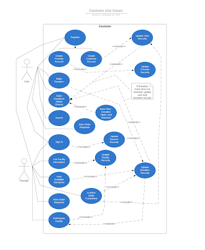

Added cases for updating records that have been added to the database. This includes donation records & facility records. Lines have been adjusted to reflect this change.

## Structure Diagram

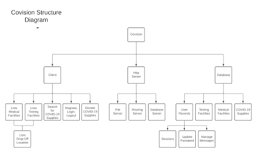

This is a basic overview of our application. Includes what can be seen on the client side, what information is stored in the database, and data being sent to the Http server.

## Sequence Diagram

### Register as a Customer or Provider

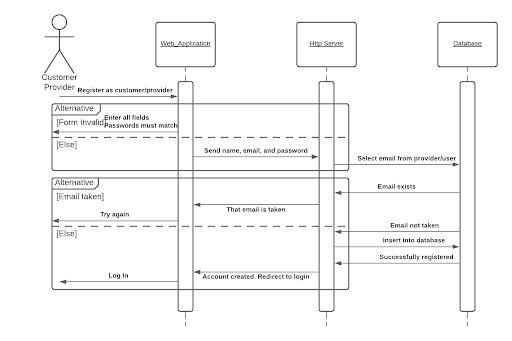

This sequence checks for a valid input form for registration and if the email does not already exist in the Provider table, create a new account.

### Login in as Customer or Provider:

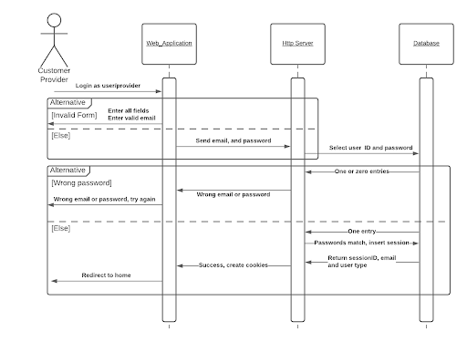

This sequence executes when a customer or provider tries to log in. It checks for the user’s credentials and on success, creates a login session.

### Check Session if Logged in as Customer or Provider

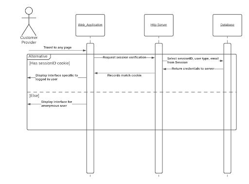

This sequence executes whenever a user travels to any page or inputs any form. It checks for a ‘logged in’ session ID and modifies the DOM accordingly.

### Post Facility as Provider

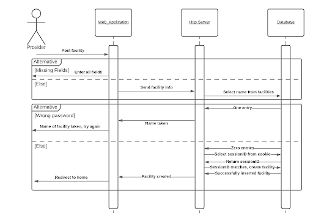

This sequence executes when a provider tries to post a facility. It checks for form validation and if the facility name is not taken, creates a new entry.

### View Facilities as Customer or Provider

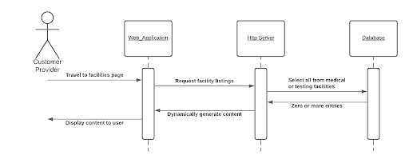

This sequence loads facilities in the database to any user.

### Manage Donation Requests as Provider

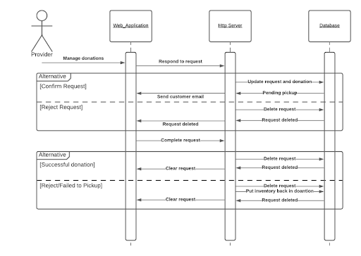

This sequence allows providers to confirm or reject requests. Upon confirmation, the donation quantity is decremented by the requested quantity but is reversed if a customer fails to pick-up.

### Request a Donation as Customer

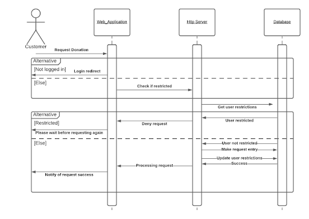

This sequence allows customers to request donations and checks logged in status and whether or not the customer has requested too frequently.

### Password Reset as Customer or Provider

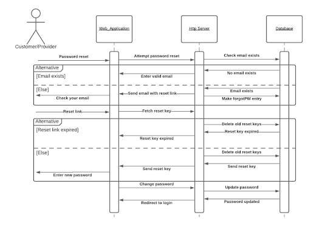

This sequence resets a user’s password. It checks if the email exists, and if it does, creates a reset key and sends a reset link to the user’s email address.

## Entity-Relationship Diagram

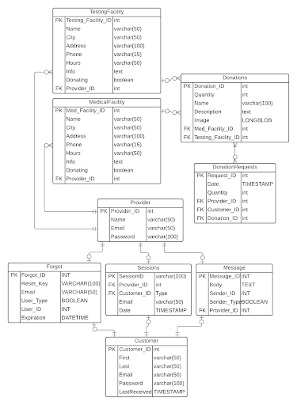

## Non-functional Specifications

Node.js - Javascript runtime environment for http server backend

- BCryptjs - Encryption for user passwords
- MySQL - Node database API

Javascript - Client-side scripting language, utilizes XMLHttpRequest

HTML - Markup language for DOM

- Bootstrap: CSS Framework, using bootstrap default

Google Cloud - Provides Ubuntu VM for http server and MySQL database instance

Certbot and Let’s Encrypt - Certificate authority to enable https

## Original Repo Screenshot

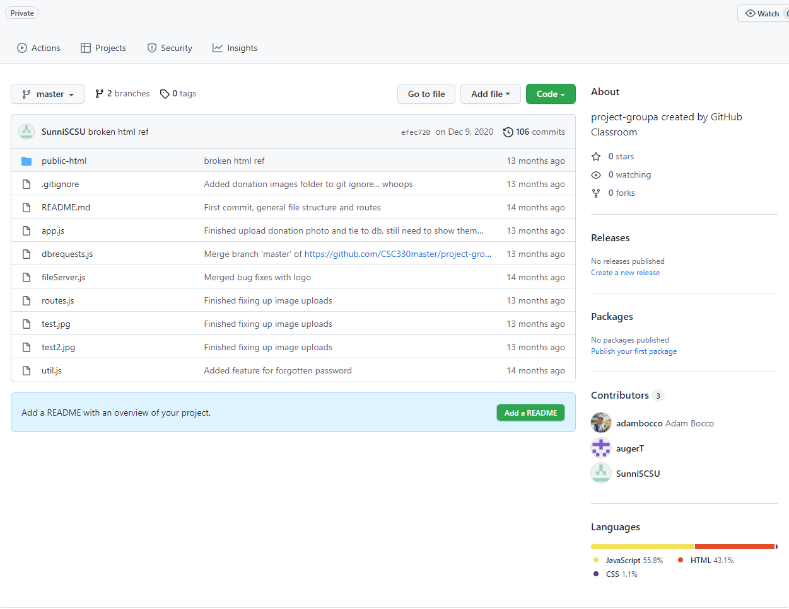
